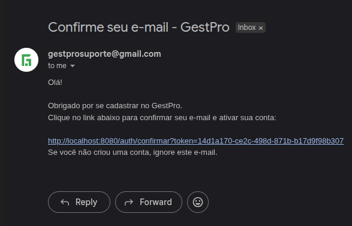
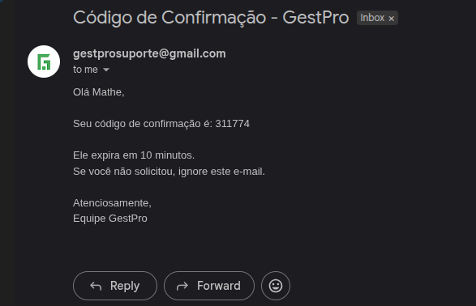

# GestPro

> **Simples para usar. Forte por dentro.**

[](LICENSE)
[](https://openjdk.org/)
[](https://nextjs.org/)
[](https://spring.io/projects/spring-boot)

---

## O que é a GestPro?

A GestPro é um **sistema de gestão online** criado para ajudar pequenos negócios a organizarem estoque, vendas e informações estratégicas em um único lugar.

Ela nasce com um objetivo simples: **transformar desorganização em controle.**

Nada de planilhas confusas. Nada de anotações soltas. Nada de decisões baseadas em "acho que".

---

## Para quem é?

A GestPro foi pensada principalmente para:

- 🏪 Pequenos comércios e lojas físicas
- 🧾 Negócios que precisam de caixa e emissão de notas
- 📦 Empreendedores que querem controle real de estoque
- 🚀 Quem quer sair das planilhas sem complicação

Não é um ERP complexo cheio de funções desnecessárias.  
É uma solução **enxuta, prática e focada no que realmente importa**.

---

## Qual problema ela resolve?

Muitos pequenos negócios enfrentam dificuldades como:

| Problema | Consequência |
|---|---|
| Falta de controle de estoque | Ruptura ou excesso sem perceber |
| Vendas não registradas corretamente | Perda de receita e histórico |
| Dificuldade para saber o lucro real | Decisões no escuro |
| Dependência de planilhas complicadas | Retrabalho e erros frequentes |
| Falta de visão sobre crescimento | Estagnação sem estratégia |

**A GestPro resolve esses problemas centralizando as informações e oferecendo uma visão clara do negócio.**

---

## O que a GestPro faz?

### 🖥️ Frente de Caixa
Sistema de PDV (Ponto de Venda) pensado para o dia a dia do comércio. Rápido, intuitivo e funcional como um caixa de mercado — só que muito melhor e mais fácil de usar.

- Registro de vendas ágil
- Múltiplas formas de pagamento
- Abertura e fechamento de caixa
- Emissão de notas e comprovantes

### 📦 Controle de Estoque
- Cadastro completo de produtos
- Movimentações de entrada e saída
- Alertas de estoque baixo
- Histórico de movimentações

### 👥 Gestão de Clientes
- Cadastro e histórico de clientes
- Consulta de compras anteriores

### 📊 Relatórios e Dashboards
- Visão geral do desempenho do negócio
- Relatórios de vendas e lucratividade
- Indicadores de performance em tempo real
- Dados reais para decisões mais seguras

---

## Interface do Sistema

<table>
  <tr>
    <td width="50%">
      <h3 align="center">Tela de Login</h3>
      
      <p align="center">Login com email/senha ou Google OAuth2</p>
    </td>
    <td width="50%">
      <h3 align="center">Dashboard Principal</h3>
      
      <p align="center">Visão geral do negócio</p>
    </td>
  </tr>
  <tr>
    <td width="50%">
      <h3 align="center">Cadastro de Usuário</h3>
      
      <p align="center">Cadastro com validação de email</p>
    </td>
    <td width="50%">
      <h3 align="center">Recuperação de Senha</h3>
      
      <p align="center">Reset de senha via email</p>
    </td>
  </tr>
</table>

---

## Diferencial da GestPro

O diferencial está na **simplicidade com estrutura sólida por trás.**

- Interface moderna e intuitiva
- Experiência focada em clareza e agilidade
- Desenvolvida com preocupação real com performance, segurança e escalabilidade
- Funciona online — acesse de qualquer lugar, a qualquer hora

---

## Tecnologias

### Frontend
- **Next.js 14+** com App Router
- **TypeScript** para tipagem estática
- **Tailwind CSS** para estilização responsiva
- **shadcn/ui** como biblioteca de componentes
- **Lucide Icons**

### Backend
- **Java 17+** com **Spring Boot 3.x**
- **Spring Security** com autenticação **JWT**
- **OAuth2** para login com Google
- **MySQL 8+** como banco de dados relacional
- **Redis** para caching e otimização de performance
- **Maven** para gerenciamento de dependências
- **Swagger/OpenAPI 3.0** para documentação da API

---

## Estrutura do Projeto

```
GestPro/
├── frontend/          # Interface do usuário (Next.js)
├── backend/           # API e lógica de negócio (Spring Boot)
├── Img/               # Imagens do README
└── README.md
```

---

## Como Rodar o Projeto

### Pré-requisitos

- **Java 17+**
- **Node.js 18+**
- **MySQL 8+**
- **Redis** (opcional para desenvolvimento local)
- **Maven** (já incluído no projeto via wrapper)

### Instalação Rápida

```bash
# 1. Clone o repositório
git clone https://github.com/MartnsDev/Gest-Pro.git
cd GestPro

# 2. Configure as variáveis de ambiente (veja a seção abaixo)

# 3. Crie o banco de dados
mysql -u root -p -e "CREATE DATABASE gestpro_db;"

# 4. Inicie o backend
cd backend
./mvnw spring-boot:run

# 5. Em outro terminal, inicie o frontend
cd frontend
npm install
npm run dev
```

Após iniciar, acesse:
- **Frontend:** `http://localhost:3000`
- **API Backend:** `http://localhost:8080`
- **Swagger Docs:** `http://localhost:8080/swagger-ui.html`

---

## Variáveis de Ambiente

> ⚠️ **Nunca faça commit de credenciais no código.**

### Windows (PowerShell)

```powershell
# Database
setx DB_URL "jdbc:mysql://localhost:3306/gestpro_db"
setx DB_USERNAME "root"
setx DB_PASSWORD "sua_senha"

# Server
setx SERVER_PORT "8080"
setx APP_BASE_URL "http://localhost:8080"

# JPA/Hibernate
setx JPA_HBM_DDL "update"
setx JPA_SHOW_SQL "true"
setx JPA_FORMAT_SQL "true"
setx JPA_OPEN_IN_VIEW "false"

# Swagger
setx SWAGGER_API_DOCS_PATH "/v3/api-docs"
setx SWAGGER_UI_PATH "/swagger-ui.html"

# JWT
setx JWT_SECRET "sua_chave_secreta_jwt_minimo_256_bits"
setx JWT_EXPIRATION "86400000"

# Basic Auth
setx BASIC_AUTH_USER "admin"
setx BASIC_AUTH_PASSWORD "admin"
setx BASIC_AUTH_ROLE "ADMIN"

# OAuth2 Google
setx GOOGLE_CLIENT_ID "seu_client_id"
setx GOOGLE_CLIENT_SECRET "seu_client_secret"
setx GOOGLE_SCOPE "openid,email,profile"
setx GOOGLE_REDIRECT_URI "http://localhost:8080/login/oauth2/code/google"
setx GOOGLE_AUTH_URI "https://accounts.google.com/o/oauth2/v2/auth"
setx GOOGLE_TOKEN_URI "https://oauth2.googleapis.com/token"
setx GOOGLE_USERINFO_URI "https://www.googleapis.com/oauth2/v3/userinfo"
setx GOOGLE_USERNAME_ATTR "sub"

# Email
setx MAIL_HOST "smtp.gmail.com"
setx MAIL_PORT "587"
setx MAIL_USERNAME "seu_email@gmail.com"
setx MAIL_PASSWORD "senha_de_app_google"
setx MAIL_SMTP_AUTH "true"
setx MAIL_SMTP_STARTTLS "true"
```

> Feche e reabra o terminal para aplicar as variáveis.

### Linux/macOS

```bash
# Edite o arquivo de configuração do shell
nano ~/.bashrc  # ou ~/.zshrc

# Adicione as variáveis:
export DB_URL="jdbc:mysql://localhost:3306/gestpro_db"
export DB_USERNAME="root"
export DB_PASSWORD="sua_senha"
export SERVER_PORT="8080"
export APP_BASE_URL="http://localhost:8080"
export JPA_HBM_DDL="update"
export JPA_SHOW_SQL="true"
export JPA_FORMAT_SQL="true"
export JPA_OPEN_IN_VIEW="false"
export SWAGGER_API_DOCS_PATH="/v3/api-docs"
export SWAGGER_UI_PATH="/swagger-ui.html"
export JWT_SECRET="sua_chave_secreta_jwt_minimo_256_bits"
export JWT_EXPIRATION="86400000"
export BASIC_AUTH_USER="admin"
export BASIC_AUTH_PASSWORD="admin"
export BASIC_AUTH_ROLE="ADMIN"
export GOOGLE_CLIENT_ID="seu_client_id"
export GOOGLE_CLIENT_SECRET="seu_client_secret"
export GOOGLE_SCOPE="openid,email,profile"
export GOOGLE_REDIRECT_URI="http://localhost:8080/login/oauth2/code/google"
export GOOGLE_AUTH_URI="https://accounts.google.com/o/oauth2/v2/auth"
export GOOGLE_TOKEN_URI="https://oauth2.googleapis.com/token"
export GOOGLE_USERINFO_URI="https://www.googleapis.com/oauth2/v3/userinfo"
export GOOGLE_USERNAME_ATTR="sub"
export MAIL_HOST="smtp.gmail.com"
export MAIL_PORT="587"
export MAIL_USERNAME="seu_email@gmail.com"
export MAIL_PASSWORD="senha_de_app_google"
export MAIL_SMTP_AUTH="true"
export MAIL_SMTP_STARTTLS="true"

# Aplique as alterações
source ~/.bashrc
```

---

## Integrações

### OAuth2 — Login com Google

#### 1. Crie um projeto no Google Cloud Console

Acesse o [Google Cloud Console](https://console.cloud.google.com) e crie um novo projeto.


#### 2. Configure a OAuth Consent Screen

Acesse **APIs e serviços → Tela de consentimento OAuth**, selecione **Externo** e preencha as informações básicas.


#### 3. Crie as Credenciais OAuth 2.0

Navegue até **Credenciais → Criar credenciais → ID do cliente OAuth** e escolha **Aplicativo da Web**.


#### 4. Adicione a URI de Redirecionamento

```
http://localhost:8080/login/oauth2/code/google
```

#### 5. Configure as variáveis

```bash
GOOGLE_CLIENT_ID="seu_client_id_aqui"
GOOGLE_CLIENT_SECRET="seu_client_secret_aqui"
```

---

### Envio de Email via SMTP (Gmail)

#### 1. Ative a Verificação em Duas Etapas

Acesse [Google Account Security](https://myaccount.google.com/security) e ative a verificação em duas etapas.

#### 2. Gere uma Senha de Aplicativo


Acesse **Senhas de app** e crie uma nova senha.


#### 3. Configure a variável

```bash
MAIL_USERNAME="seu_email@gmail.com"
MAIL_PASSWORD="xxxx xxxx xxxx xxxx"  # senha de app de 16 caracteres
```

#### Emails que o sistema envia

**Confirmação de cadastro** — código de 6 dígitos com validade de 10 minutos:



**Recuperação de senha** — código temporário para redefinir com segurança:



---

## Documentação da API

Documentação interativa completa via **Swagger/OpenAPI 3.0**, disponível após iniciar o backend:

```
http://localhost:8080/swagger-ui.html
```


**Grupos de endpoints disponíveis:**
- **Autenticação** — login, cadastro, confirmação de email
- **Usuário** — perfil e atualização de dados
- **Caixa** — abertura, fechamento e movimentações
- **Produtos** — CRUD completo
- **Estoque** — controle de movimentações
- **Vendas** — registro e consulta
- **Clientes** — gestão de cadastro
- **Relatórios** — dashboards e analytics

---

## Segurança

- **JWT** com tokens de refresh
- **OAuth2** para login social
- **BCrypt** para criptografia de senhas
- **Validação de email obrigatória** para ativar contas
- **Códigos de verificação** com tempo de expiração
- **Proteção CSRF**
- **Rate limiting** para prevenir abuso da API

---

## Boas Práticas e Avisos

- Nunca versione credenciais, tokens ou secrets no repositório — use sempre variáveis de ambiente.
- Use uma chave JWT com no mínimo **256 bits**. Chaves fracas comprometem toda a aplicação.
- Use um **email dedicado** para envios do sistema, nunca email pessoal em produção.
- Em produção, desative `show-sql`, `ddl-auto=update` e logs detalhados.
- **Redis é fortemente recomendado em produção** para caching, sessões e redução de carga no banco.

---

## Links

- [Código do Frontend](https://github.com/MartnsDev/Gest-Pro/tree/2ced41f10df3341faa91cdcd0596061cfdcbc920/FrontEnd)
- [Código do Backend](https://github.com/MartnsDev/Gest-Pro/tree/2ced41f10df3341faa91cdcd0596061cfdcbc920/Backend)

---

## Licença

Todos os direitos reservados © 2025 Matheus Martins (MartnsDev)

Este projeto é de minha autoria e não pode ser copiado, reproduzido ou utilizado sem autorização expressa.

---

## Sobre o Autor

**Matheus Martins**

Desenvolvedor apaixonado por criar soluções que realmente funcionam na prática. A GestPro nasceu da vontade de aprender construindo algo útil.

- LinkedIn: [@matheusmartnsdev](https://www.linkedin.com/in/matheusmartnsdev/)
- GitHub: [@MartnsDev](https://github.com/MartnsDev)

---

Desenvolvido com 💚 por Matheus Martins
