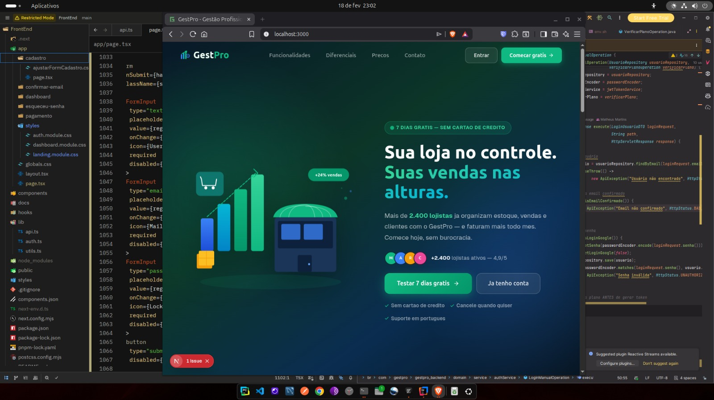
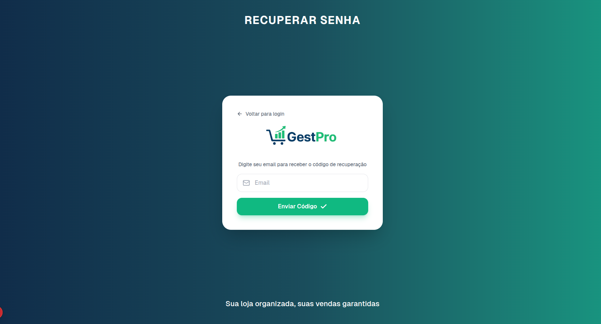
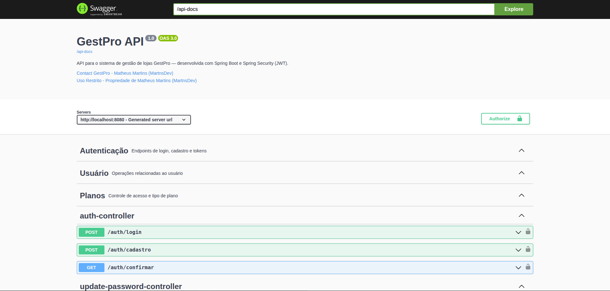

# GestPro

> **Simples para usar. Forte por dentro.**

[](LICENSE)
[](https://openjdk.org/)
[](https://nextjs.org/)
[](https://spring.io/projects/spring-boot)

---

## O que é a GestPro?

A GestPro é um **sistema de gestão online** criado para ajudar pequenos negócios a organizarem estoque, vendas e informações estratégicas em um único lugar.

Ela nasce com um objetivo simples: **transformar desorganização em controle.**

Nada de planilhas confusas. Nada de anotações soltas. Nada de decisões baseadas em "acho que".

---

## Para quem é?

A GestPro foi pensada principalmente para:

- 🏪 Pequenos comércios e lojas físicas
- 🧾 Negócios que precisam de caixa e emissão de notas
- 📦 Empreendedores que querem controle real de estoque
- 🚀 Quem quer sair das planilhas sem complicação

Não é um ERP complexo cheio de funções desnecessárias.  
É uma solução **enxuta, prática e focada no que realmente importa**.

---

## Qual problema ela resolve?

Muitos pequenos negócios enfrentam dificuldades como:

| Problema | Consequência |
|---|---|
| Falta de controle de estoque | Ruptura ou excesso sem perceber |
| Vendas não registradas corretamente | Perda de receita e histórico |
| Dificuldade para saber o lucro real | Decisões no escuro |
| Dependência de planilhas complicadas | Retrabalho e erros frequentes |
| Falta de visão sobre crescimento | Estagnação sem estratégia |

**A GestPro resolve esses problemas centralizando as informações e oferecendo uma visão clara do negócio.**

---

## O que a GestPro faz?

### 🖥️ Frente de Caixa
Sistema de PDV (Ponto de Venda) pensado para o dia a dia do comércio. Rápido, intuitivo e funcional como um caixa de mercado — só que muito melhor e mais fácil de usar.

- Registro de vendas ágil
- Múltiplas formas de pagamento
- Abertura e fechamento de caixa
- Emissão de notas e comprovantes

### 📦 Controle de Estoque
- Cadastro completo de produtos
- Movimentações de entrada e saída
- Alertas de estoque baixo
- Histórico de movimentações

### 👥 Gestão de Clientes
- Cadastro e histórico de clientes
- Consulta de compras anteriores

### 📊 Relatórios e Dashboards
- Visão geral do desempenho do negócio
- Relatórios de vendas e lucratividade
- Indicadores de performance em tempo real
- Dados reais para decisões mais seguras

---

## Interface do Sistema

<table>
  <tr>
    <td width="50%">
      <h3 align="center">Tela de Login</h3>
      
      <p align="center">Login com email/senha ou Google OAuth2</p>
    </td>
    <td width="50%">
      <h3 align="center">Dashboard Principal</h3>
      
      <p align="center">Visão geral do negócio</p>
    </td>
  </tr>
  <tr>
    <td width="50%">
      <h3 align="center">Cadastro de Usuário</h3>
      
      <p align="center">Cadastro com validação de email</p>
    </td>
    <td width="50%">
      <h3 align="center">Recuperação de Senha</h3>
      
      <p align="center">Reset de senha via email</p>
    </td>
  </tr>
</table>

---

## Diferencial da GestPro

O diferencial está na **simplicidade com estrutura sólida por trás.**

- Interface moderna e intuitiva
- Experiência focada em clareza e agilidade
- Desenvolvida com preocupação real com performance, segurança e escalabilidade
- Funciona online — acesse de qualquer lugar, a qualquer hora

---

## Tecnologias

### Frontend
- **Next.js 14+** com App Router
- **TypeScript** para tipagem estática
- **Tailwind CSS** para estilização responsiva
- **shadcn/ui** como biblioteca de componentes
- **Lucide Icons**
- **Chart.js**

### Backend
- **Java 17+** com **Spring Boot 3.x**
- **Spring Security** com autenticação **JWT**
- **OAuth2** para login com Google
- **MySQL 8+** como banco de dados relacional
- **Redis** para caching e otimização de performance
- **Maven** para gerenciamento de dependências
- **Swagger/OpenAPI 3.0** para documentação da API
- **Node.js 18+**
- **Redis** (opcional para desenvolvimento local)
- **Maven**
- **Docker** (Subir projeto de forma mais facil, subir o redis também)

---

## Estrutura do Projeto

```
GestPro/
├── frontend/          # Interface do usuário (Next.js)
├── backend/           # API e lógica de negócio (Spring Boot)
├── Img/               # Imagens do README
└── README.md
```

---


## Documentação da API

Documentação interativa completa via **Swagger/OpenAPI 3.0**, disponível após iniciar o backend:

```
http://localhost:8080/swagger-ui.html
```



**Grupos de endpoints disponíveis:**
- **Autenticação** — login, cadastro, confirmação de email
- **Usuário** — perfil e atualização de dados
- **Caixa** — abertura, fechamento e movimentações
- **Produtos** — CRUD completo
- **Estoque** — controle de movimentações
- **Vendas** — registro e consulta
- **Clientes** — gestão de cadastro
- **Relatórios** — dashboards e analytics

---

## Segurança

- **JWT** com tokens de refresh
- **OAuth2** para login social
- **BCrypt** para criptografia de senhas
- **Validação de email obrigatória** para ativar contas
- **Códigos de verificação** com tempo de expiração
- **Proteção CSRF**
- **Rate limiting** para prevenir abuso da API

---

## Boas Práticas e Avisos

- Nunca versione credenciais, tokens ou secrets no repositório — use sempre variáveis de ambiente.
- Use uma chave JWT com no mínimo **256 bits**. Chaves fracas comprometem toda a aplicação.
- Use um **email dedicado** para envios do sistema, nunca email pessoal em produção.
- Em produção, desative `show-sql`, `ddl-auto=update` e logs detalhados.
- **Redis é fortemente recomendado em produção** para caching, sessões e redução de carga no banco.

---

## Links

- [Código do Frontend](https://github.com/MartnsDev/Gest-Pro/tree/2ced41f10df3341faa91cdcd0596061cfdcbc920/FrontEnd)
- [Código do Backend](https://github.com/MartnsDev/Gest-Pro/tree/2ced41f10df3341faa91cdcd0596061cfdcbc920/Backend)

---

## Licença

Todos os direitos reservados © 2025 Matheus Martins (MartnsDev)

Este projeto é de minha autoria e não pode ser copiado, reproduzido ou utilizado sem autorização expressa.

---

## Sobre o Autor

**Matheus Martins**

Desenvolvedor apaixonado por criar soluções que realmente funcionam na prática. A GestPro nasceu da vontade de aprender construindo algo útil.

- LinkedIn: [@matheusmartnsdev](https://www.linkedin.com/in/matheusmartnsdev/)
- GitHub: [@MartnsDev](https://github.com/MartnsDev)

---

Desenvolvido com 💚 por Matheus Martins
