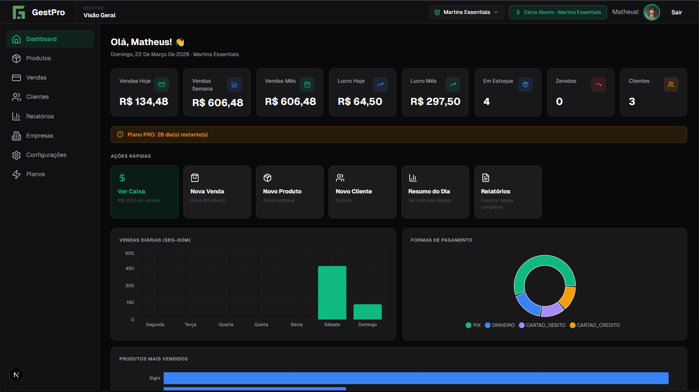
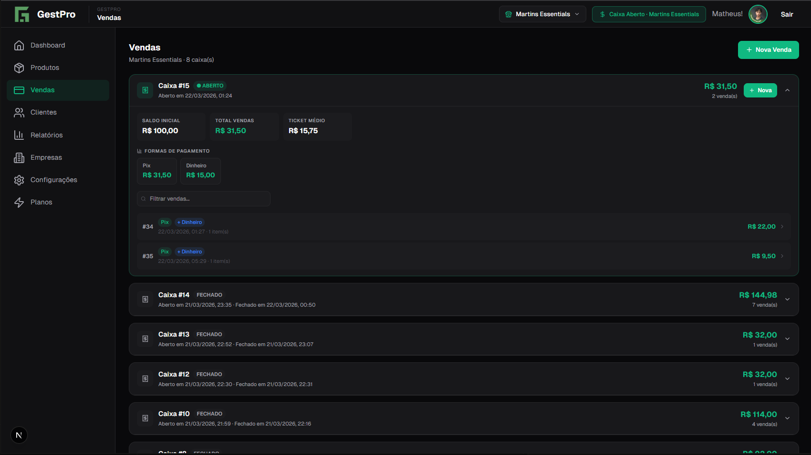
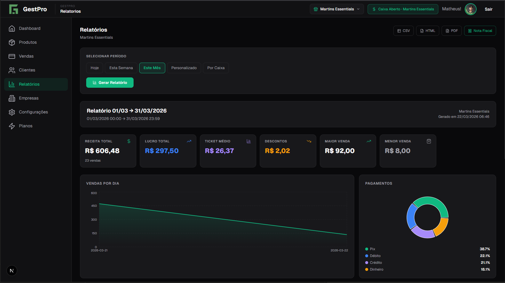

<div align="center">


# GestPro

**Sistema de Gestão para Pequenos Negócios**

*Controle de caixa, estoque, vendas e relatórios — tudo em um único lugar.*

<br/>

[](https://openjdk.org/)
[](https://spring.io/projects/spring-boot)
[](https://nextjs.org/)
[](https://www.typescriptlang.org/)
[](https://www.mysql.com/)
[](LICENSE)

<br/>

[Visão Geral](#-visão-geral) · [Funcionalidades](#-funcionalidades) · [Arquitetura](#-arquitetura) · [Instalação](#-instalação) · [API](#-documentação-da-api) · [Segurança](#-segurança) · [Autor](#-autor)

</div>

---

## 📌 Visão Geral

O **GestPro** é um sistema de gestão comercial desenvolvido para pequenos negócios que precisam de controle real — sem a complexidade de um ERP tradicional e sem a fragilidade de planilhas.

Ele resolve um problema concreto: **a maioria dos pequenos comerciantes não tem visibilidade sobre o próprio negócio.** Não sabem com precisão quanto vendem por dia, qual produto mais lucra, se o estoque vai faltar amanhã, ou se o caixa fecha no positivo. O GestPro entrega essas respostas de forma simples, visual e acessível.

### O que torna o GestPro diferente

- **Frente de caixa real** — não é só um cadastro de produtos, é um PDV funcional com suporte a pagamento misto, troco, cancelamento e emissão de cupom
- **Multitenant nativo** — um único usuário pode gerenciar múltiplas empresas com caixas e estoques independentes
- **Relatórios exportáveis** — HTML com gráficos, CSV, PDF e cupom não fiscal, gerados no cliente sem dependência de servidor
- **Arquitetura segura** — autenticação via JWT + HttpOnly cookies, OAuth2 com Google, e proteção por plano

---

## 🖥️ Interface

<table>
  <tr>
    <td align="center" width="50%">
      
      <br/><sub><b>Landing Page & Login</b></sub>
    </td>
    <td align="center" width="50%">
      
      <br/><sub><b>Dashboard com métricas em tempo real</b></sub>
    </td>
  </tr>
  <tr>
    <td align="center" width="50%">
      
      <br/><sub><b>Vendas PDV</b></sub>
    </td>
    <td align="center" width="50%">
      
      <br/><sub><b>Relatorio</b></sub>
    </td>
  </tr>
</table>

---

## ✅ Funcionalidades

### 🏧 Frente de Caixa (PDV)
- Registro de vendas com busca rápida de produtos
- **Pagamento misto** — até 2 formas por venda (ex: R$ 5 no Pix + R$ 15 em dinheiro)
- Cálculo automático de troco e alerta de falta
- Desconto por venda com recalculo em tempo real
- Cancelamento com devolução automática ao estoque
- Edição de observação pós-venda
- **Cupom não fiscal** gerado no frontend (80mm, pronto para impressora térmica)
- Múltiplos caixas por empresa com abertura, fechamento e resumo

### 📦 Estoque
- Cadastro completo: nome, categoria, unidade, código de barras, preços de custo e venda
- Preview de **lucro unitário e margem** em tempo real durante o cadastro
- Alertas de estoque mínimo no dashboard
- Dedução automática a cada venda, reposição a cada cancelamento

### 👥 Clientes & Fornecedores
- Cadastro com diferenciação de tipo (Cliente / Fornecedor)
- Campos específicos por tipo: CPF para clientes, CNPJ + contato para fornecedores
- Vínculo de cliente à venda

### 📊 Relatórios
- Períodos: hoje, semana, mês, personalizado ou por caixa
- Métricas: receita, lucro estimado, ticket médio, maior/menor venda, cancelamentos
- Gráficos: vendas diárias (área), formas de pagamento (pizza), top produtos (barras horizontais), pico por hora
- Exportação em **CSV**, **HTML com gráficos CSS**, **PDF** (via impressão do browser) e **cupom não fiscal**

### 🏢 Multi-empresa
- Cada conta pode gerenciar múltiplas empresas
- Dados completamente isolados por `empresa_id`
- Seleção de empresa ativa no header com persistência em `localStorage`

### ⚙️ Configurações
- Upload de foto de perfil (salvo no backend, servido como static file)
- Troca de senha com **código de verificação por e-mail** (expira em 10 minutos)
- Informações do plano atual com dias restantes
- Preferências de notificação
- Suporte via e-mail (formulário `mailto:`) e WhatsApp

---

## 🏗️ Arquitetura

```
GestPro/
├── FrontEnd/                   # Next.js 14 App Router
│   └── app/
│       └── dashboard/
│           ├── components/     # Todos os módulos do dashboard
│           │   ├── aceoesRapidas/   # Overlays de ação rápida
│           │   ├── DashboardHome.tsx
│           │   ├── Vendas.tsx
│           │   ├── Produtos.tsx
│           │   ├── Clientes.tsx
│           │   ├── Relatorios.tsx
│           │   └── Configuracoes.tsx
│           └── context/
│               └── Empresacontext.tsx   # Estado global multitenant
│
└── Backend/                    # Spring Boot 3.x
    └── src/main/java/br/com/gestpro/
        ├── auth/               # Autenticação JWT + OAuth2
        ├── usuario/            # Perfil e configurações
        ├── empresa/            # Gestão de empresas
        ├── caixa/              # Abertura, fechamento, resumo
        ├── produto/            # CRUD de produtos
        ├── venda/              # PDV e histórico
        ├── cliente/            # Clientes e fornecedores
        ├── analytics/          # Relatórios e dashboards
        ├── configuracao/       # Configurações do usuário
        └── infra/              # JWT, exceptions, config
```

### Modelo de dados — principais relações

```
Usuario
  └── Empresa (1:N)
        ├── Caixa (1:N)
        │     └── Venda (1:N)
        │           └── ItemVenda (1:N) → Produto
        ├── Produto (1:N)
        └── Cliente (1:N)
```

### Fluxo de autenticação

```
Login (email/senha ou Google OAuth2)
  → Backend valida credenciais
  → Gera JWT (HS256, 24h)
  → Seta cookie HttpOnly (não acessível via JS)
  → Frontend usa credentials: "include" em todas as requests
  → Spring Security valida o cookie a cada request
```

---

## 🛠️ Tecnologias

### Frontend
| Tecnologia | Versão | Uso |
|---|---|---|
| Next.js | 14+ | Framework React com App Router |
| TypeScript | 5+ | Tipagem estática |
| Tailwind CSS | 3+ | Estilização utilitária |
| Recharts | 2+ | Gráficos interativos |
| Lucide React | — | Ícones |
| Sonner | — | Toasts/notificações |

### Backend
| Tecnologia | Versão | Uso |
|---|---|---|
| Java | 17+ | Linguagem principal |
| Spring Boot | 3.x | Framework principal |
| Spring Security | 6+ | Autenticação e autorização |
| Spring Data JPA | — | ORM / repositórios |
| MySQL | 8+ | Banco de dados relacional |
| JWT (JJWT) | — | Tokens de autenticação |
| OAuth2 | — | Login com Google |
| JavaMailSender | — | Envio de e-mails |
| Maven | — | Gerenciamento de dependências |

---

## 🚀 Instalação

### Pré-requisitos
- Java 17+
- Node.js 18+
- MySQL 8+
- Maven 3.8+

### Backend

```bash
# Clone o repositório
git clone https://github.com/MartnsDev/Gest-Pro.git
cd Gest-Pro/Backend

# Configure o application.properties
cp src/main/resources/application.properties.example \
   src/main/resources/application.properties
```

Edite `application.properties` com suas credenciais:

```properties
# Banco de dados
spring.datasource.url=jdbc:mysql://localhost:3306/gestpro?serverTimezone=America/Sao_Paulo
spring.datasource.username=root
spring.datasource.password=sua_senha

# JWT — use uma chave com no mínimo 256 bits
jwt.secret=sua_chave_secreta_de_256_bits

# E-mail (Gmail recomendado)
spring.mail.username=seu_email@gmail.com
spring.mail.password=sua_app_password

# OAuth2 Google
spring.security.oauth2.client.registration.google.client-id=seu_client_id
spring.security.oauth2.client.registration.google.client-secret=seu_client_secret

# Perfil
spring.jpa.show-sql=false
spring.jpa.hibernate.ddl-auto=update
```

```bash
# Iniciar o backend
mvn spring-boot:run
```

O backend estará disponível em `http://localhost:8080`.

### Frontend

```bash
cd ../FrontEnd

# Instale as dependências
npm install

# Configure as variáveis de ambiente
cp .env.example .env.local
```

```env
NEXT_PUBLIC_API_URL=http://localhost:8080
```

```bash
# Iniciar em desenvolvimento
npm run dev
```

O frontend estará disponível em `http://localhost:3000`.

---

## 📡 Documentação da API

Documentação interativa via **Swagger / OpenAPI 3.0**:

```
http://localhost:8080/swagger-ui.html
```


### Principais endpoints

| Método | Endpoint | Descrição |
|---|---|---|
| `POST` | `/auth/login` | Autenticação com email/senha |
| `POST` | `/auth/cadastro` | Criação de conta |
| `POST` | `/auth/logout` | Invalidação de sessão |
| `GET` | `/api/usuario` | Dados do usuário autenticado |
| `GET` | `/api/v1/empresas` | Listar empresas do usuário |
| `POST` | `/api/v1/caixas/abrir` | Abrir caixa |
| `POST` | `/api/v1/caixas/fechar` | Fechar caixa |
| `GET` | `/api/v1/produtos?empresaId=` | Listar produtos |
| `POST` | `/api/v1/vendas/registrar` | Registrar venda |
| `POST` | `/api/v1/vendas/{id}/cancelar` | Cancelar venda |
| `GET` | `/api/v1/relatorios/hoje` | Relatório do dia |
| `GET` | `/api/v1/relatorios/mes` | Relatório mensal |
| `GET` | `/api/v1/dashboard/visao-geral` | Métricas do dashboard |
| `PUT` | `/api/v1/configuracoes/perfil/nome` | Atualizar nome |
| `POST` | `/api/v1/configuracoes/perfil/foto` | Upload de foto |
| `POST` | `/api/v1/configuracoes/senha/trocar` | Trocar senha com código |

Todos os endpoints autenticados exigem cookie JWT (`credentials: "include"`). Não há headers de Authorization — a autenticação é feita exclusivamente via cookie HttpOnly.

---

## 🔐 Segurança

| Camada | Implementação |
|---|---|
| Autenticação | JWT HS256 em cookie HttpOnly — inacessível via JavaScript |
| Login social | OAuth2 com Google via Spring Security |
| Senhas | BCrypt com salt automático |
| Troca de senha | Código de 6 dígitos por e-mail, válido por 10 minutos |
| Autorização | Validação de `empresa_id` em todas as queries (nenhum usuário acessa dados de outra empresa) |
| Email | Confirmação obrigatória antes do primeiro acesso |
| CORS | Configurado explicitamente para `localhost:3000` em dev |

---

## 📋 Planos e Limites

| Plano | Duração | Empresas | Caixas |
|---|---|---|---|
| Experimental | 7 dias | 1 | 1 |
| Básico | 30 dias | 1 | 1 |
| Pro | 30 dias | 2 | 3 |
| Premium | 30 dias | Ilimitado | Ilimitado |

---

## 🤝 Boas Práticas para Deploy

- **Nunca** versione `application.properties` com credenciais reais — use variáveis de ambiente
- Use uma chave JWT com **no mínimo 256 bits** — chaves fracas comprometem toda a aplicação
- Em produção, configure `spring.jpa.show-sql=false` e `ddl-auto=validate`
- Use um **e-mail dedicado** para envios (não e-mail pessoal)
- Configure HTTPS — o cookie JWT usa `Secure: true` em produção
- A pasta `uploads/` precisa de permissão de escrita no servidor

---

## 📁 Estrutura de Pastas Detalhada

<details>
<summary>Expandir estrutura do Backend</summary>

```
Backend/src/main/java/br/com/gestpro/
├── auth/
│   ├── controller/     AuthController, UsuarioController
│   ├── dto/            LoginRequest, UsuarioResponse
│   ├── model/          Usuario
│   ├── repository/     UsuarioRepository
│   └── service/        AuthenticationService, EmailService
├── empresa/
│   ├── controller/     EmpresaController
│   ├── model/          Empresa
│   └── repository/     EmpresaRepository
├── caixa/
│   ├── controller/     CaixaController
│   ├── model/          Caixa
│   └── repository/     CaixaRepository
├── produto/
│   ├── controller/     ProdutoController
│   ├── model/          Produto
│   └── repository/     ProdutoRepository
├── venda/
│   ├── controller/     VendaController
│   ├── dto/            RegistrarVendaDTO, VendaResponseDTO
│   ├── model/          Venda, ItemVenda
│   └── service/        VendaServiceImpl
├── cliente/
│   ├── controller/     ClienteController
│   ├── dto/            ClienteDTO, ClienteRequest
│   └── model/          Cliente
├── analytics/
│   ├── controller/     RelatorioController
│   ├── dto/            RelatorioDTO
│   └── repository/     RelatorioRepository, GraficoRepository
├── dashboard/
│   ├── controller/     DashboardController
│   └── repository/     DashboardRepository
├── configuracao/
│   ├── controller/     ConfiguracaoController
│   ├── dto/            PerfilDTO, TrocarSenhaDTO
│   └── service/        ConfiguracaoServiceImpl
├── plano/
│   ├── TipoPlano       (enum com duração e limites)
│   └── StatusAcesso    (enum ATIVO/INATIVO)
└── infra/
    ├── config/         WebConfig, SecurityConfig
    ├── exception/      GlobalExceptionHandler, ApiException
    └── jwt/            JwtService, JwtAuthFilter
```

</details>

<details>
<summary>Expandir estrutura do Frontend</summary>

```
FrontEnd/app/
├── dashboard/
│   ├── components/
│   │   ├── aceoesRapidas/
│   │   │   ├── NovaVenda.tsx        Overlay PDV completo
│   │   │   ├── NovoProduto.tsx      Overlay cadastro de produto
│   │   │   ├── NovoCliente.tsx      Overlay cadastro de contato
│   │   │   └── AbrirCaixa.tsx       Overlay gestão de caixa
│   │   ├── DashboardHome.tsx        Home com ações rápidas e gráficos
│   │   ├── Vendas.tsx               PDV + histórico por caixa
│   │   ├── Produtos.tsx             CRUD de produtos com estoque
│   │   ├── Clientes.tsx             Clientes e fornecedores
│   │   ├── Relatorios.tsx           Relatórios + exportação
│   │   ├── Configuracoes.tsx        Perfil, senha, plano, suporte
│   │   ├── GerenciarEmpresas.tsx    CRUD de empresas
│   │   └── ModalCaixa.tsx           Modal abertura/fechamento
│   ├── context/
│   │   └── Empresacontext.tsx       Estado global (empresa + caixa ativo)
│   └── page.tsx                     Shell do dashboard com navegação
├── auth/                            Páginas de login e cadastro
└── lib/
    ├── api.ts                       Funções de autenticação e tipos
    └── auth.ts                      Gerenciamento de token/sessão
```

</details>

---

## 🔗 Links

- **Frontend:** [github.com/MartnsDev/Gest-Pro/FrontEnd](https://github.com/MartnsDev/Gest-Pro/tree/main/FrontEnd)
- **Backend:** [github.com/MartnsDev/Gest-Pro/Backend](https://github.com/MartnsDev/Gest-Pro/tree/main/Backend)
- **LinkedIn:** [@matheusmartnsdev](https://www.linkedin.com/in/matheusmartnsdev/)
- **Instagram:** [@gestpro.app](https://www.instagram.com/gestpro.app/)

---

## 📄 Licença

```
Copyright © 2025 Matheus Martins (MartnsDev)
Todos os direitos reservados.

Este software e seu código-fonte são de propriedade exclusiva do autor.
Não é permitida a cópia, reprodução, modificação ou redistribuição
sem autorização expressa por escrito do autor.
```

---

<div align="center">

Desenvolvido com 💚 por **Matheus Martins**

*GestPro — Controle real para negócios reais.*

</div>
