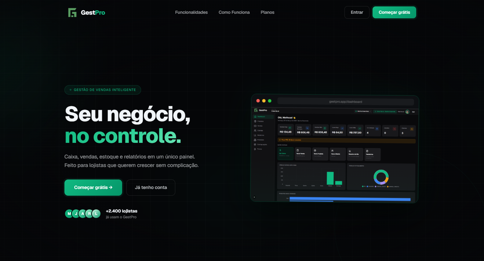
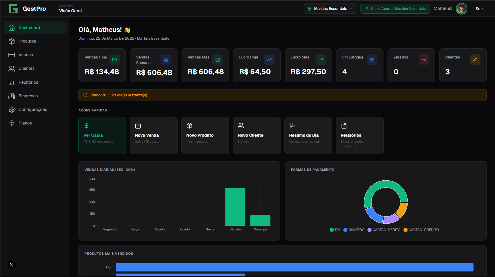
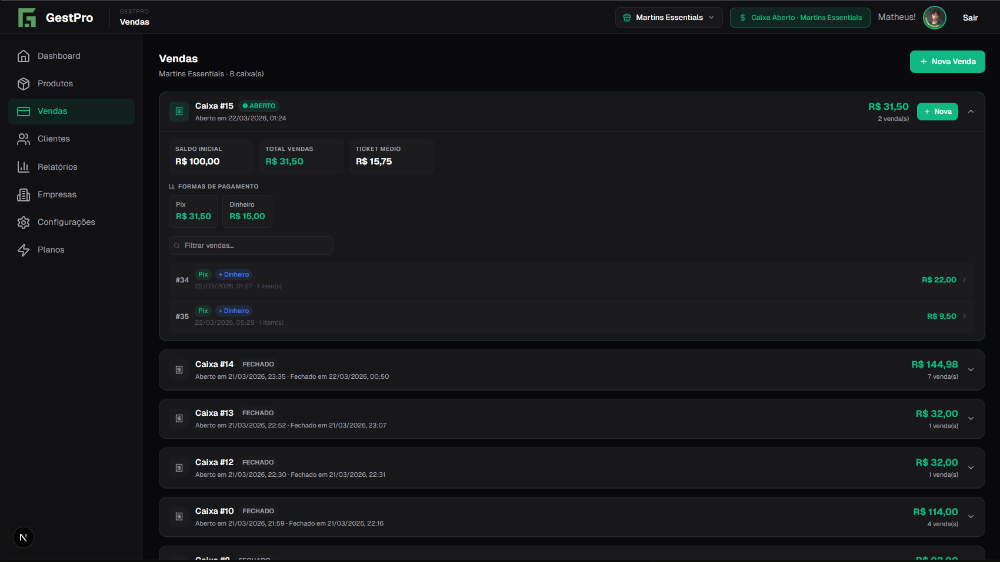
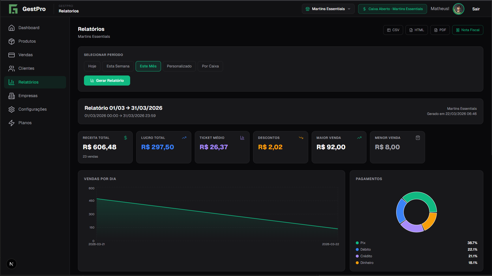
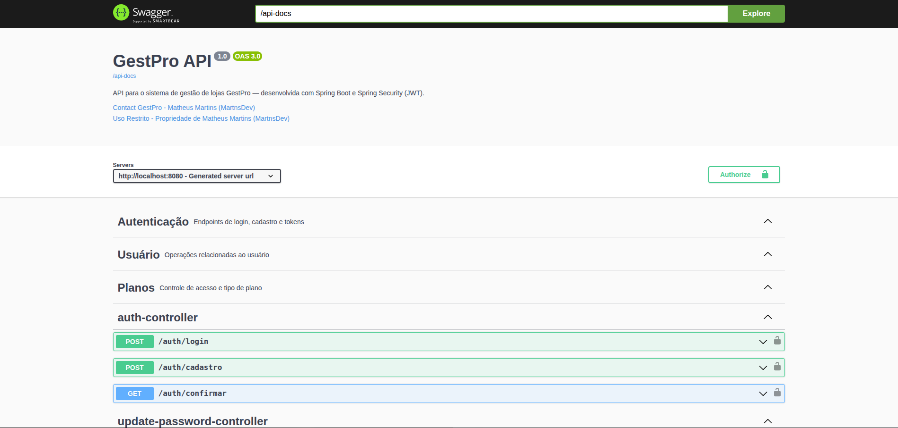

<div align="center">


# Gevyro

### Gestão em evolução.

Plataforma de gestão empresarial criada para centralizar vendas, estoque, caixa, clientes e informações importantes da operação em um único ambiente.

<br />

[Conheça a Gevyro](https://www.gevyro.com.br) · [Produto](#uma-visão-mais-clara-do-negócio) · [Tecnologia](#tecnologia) · [Segurança](#segurança)

<br />

[](https://openjdk.org/)
[](https://spring.io/projects/spring-boot)
[](https://nextjs.org/)
[](https://www.typescriptlang.org/)
[](https://www.mysql.com/)

</div>

<br />

## Administrar uma empresa não deveria significar procurar informações em vários lugares

Uma venda acontece.

O estoque muda.

O caixa recebe uma movimentação.

Um cliente compra.

Novos dados são gerados.

Quando cada uma dessas informações está em um lugar diferente, entender o que realmente está acontecendo com a empresa se torna mais difícil do que deveria.

A Gevyro nasceu para reunir essa operação.

Vendas, estoque, produtos, clientes, caixa e indicadores passam a fazer parte de um mesmo ambiente.

Não para adicionar mais uma ferramenta à rotina.

Para tornar a gestão mais clara.

<br />

<div align="center">

### Sua operação em um só lugar.

Vendas · Estoque · Caixa · Clientes · Empresas · Relatórios

</div>

<br />

## Uma visão mais clara do negócio

A Gevyro organiza diferentes partes da operação para que elas funcionem de maneira conectada.

Uma venda registrada no PDV não termina na tela de vendas.

Ela movimenta o estoque, pertence a um caixa, pode estar relacionada a um cliente e passa a fazer parte dos indicadores utilizados para acompanhar a empresa.

É essa conexão que transforma registros isolados em informação útil.

<br />

<table>
<tr>
<td width="50%" valign="top">

### Vendas

Uma frente de caixa integrada à operação.

Produtos, descontos, diferentes formas de pagamento, troco, histórico e cancelamentos fazem parte do mesmo fluxo.

</td>
<td width="50%" valign="top">

### Estoque

A quantidade disponível acompanha as movimentações realizadas pelo sistema.

Produtos podem possuir informações de custo, venda, margem, categoria, código de barras e estoque mínimo.

</td>
</tr>

<tr>
<td width="50%" valign="top">

### Caixa

Abertura, movimentações e fechamento ficam relacionados às vendas realizadas durante a operação.

</td>
<td width="50%" valign="top">

### Clientes

Informações comerciais podem ser centralizadas e relacionadas às operações realizadas pela empresa.

</td>
</tr>

<tr>
<td width="50%" valign="top">

### Indicadores

Os dados gerados pela própria operação alimentam dashboards e relatórios para facilitar o acompanhamento do negócio.

</td>
<td width="50%" valign="top">

### Empresas

Uma conta pode trabalhar com diferentes empresas conforme as regras de acesso disponíveis, mantendo suas operações separadas.

</td>
</tr>
</table>

<br />

## A Gevyro por dentro

<table>
<tr>
<td align="center" width="50%">

<br />
<sub><b>Experiência de entrada da plataforma</b></sub>
</td>

<td align="center" width="50%">

<br />
<sub><b>Visão geral da operação</b></sub>
</td>
</tr>

<tr>
<td align="center" width="50%">

<br />
<sub><b>Vendas e frente de caixa</b></sub>
</td>

<td align="center" width="50%">

<br />
<sub><b>Indicadores e análise da operação</b></sub>
</td>
</tr>
</table>

<br />

## Da operação para a informação

A arquitetura do produto acompanha o fluxo da operação empresarial.

```text
Empresa

    Produtos
        ↓
      Venda
        ↓
      Caixa

        ↓

Dados da operação

        ↓

Dashboard
Relatórios
Indicadores
```

Cada módulo possui sua responsabilidade, mas os dados trabalham em conjunto.

Isso permite que a plataforma evolua sem transformar cada nova funcionalidade em uma ferramenta isolada.

<br />

## Tecnologia

A Gevyro também é um projeto de engenharia de software.

A interface é construída com Next.js, React e TypeScript.

A API utiliza Java e Spring Boot, com Spring Security para autenticação e autorização e Spring Data JPA para persistência.

O MySQL mantém os dados relacionais da aplicação.

```text
Next.js + React + TypeScript

            ↓

        REST API

            ↓

Java + Spring Boot + Spring Security

            ↓

           MySQL
```

A aplicação também utiliza JWT, OAuth2, Hibernate, Jakarta Validation, Maven, Tailwind CSS e ferramentas complementares do ecossistema utilizado pelo projeto.

A documentação técnica detalhada do backend fica disponível em:

```text
Backend/README.md
```

<br />

## Segurança

Recursos protegidos passam pelas camadas de autenticação e autorização da aplicação.

A Gevyro utiliza Spring Security, BCrypt para senhas, autenticação baseada em JWT e suporte a OAuth2.

Sessões podem utilizar cookies HttpOnly para impedir que o token seja acessado diretamente pelo JavaScript executado no navegador.

O acesso aos dados empresariais considera a relação entre o usuário autenticado e a empresa responsável pelo recurso solicitado.

Segredos, credenciais e chaves utilizadas pelos ambientes da aplicação não devem fazer parte do código fonte versionado.

<br />

## Construída para evoluir

Gevyro não foi escolhida apenas como um novo nome para um sistema.

O nome representa a direção do produto.

**GE** parte de Gestão Empresarial.

**VYRO** é uma construção própria inspirada na ideia de virada, transformação e mudança de direção.

Uma empresa muda todos os dias.

Novos clientes chegam.

Produtos mudam.

Vendas acontecem.

Decisões precisam ser tomadas.

A tecnologia que acompanha essa operação também precisa evoluir.

É daí que nasce a assinatura da marca.

<div align="center">

## Gestão em evolução.

</div>

<br />

## Desenvolvimento

A Gevyro está em desenvolvimento contínuo.

Novos recursos, melhorias de experiência, alterações de arquitetura e evolução das regras de negócio fazem parte do desenvolvimento do produto.

Este repositório representa a implementação técnica da plataforma.

Informações sobre endpoints, configuração do ambiente, arquitetura do backend e execução local ficam concentradas na documentação técnica do projeto.

<br />

## Informações institucionais

**Marca:** Gevyro

**Segmento:** Software de gestão empresarial

**CNPJ:** 68.259.534/0001-70

**Website:** [www.gevyro.com.br](https://www.gevyro.com.br)

<br />

## Desenvolvimento e autoria

Desenvolvido por **Matheus Martins · MartnsDev**

[GitHub](https://github.com/MartnsDev) · [LinkedIn](https://www.linkedin.com/in/matheusmartnsdev/)

<br />

## Direitos

Copyright © 2025 Matheus Martins.

Todos os direitos reservados.

O código fonte e os demais componentes deste repositório permanecem sujeitos aos termos definidos pelo titular dos direitos.

Consulte o arquivo `LICENSE` para informações aplicáveis ao uso do código.

<br />

<div align="center">


### GEVYRO

**Gestão em evolução.**

[www.gevyro.com.br](https://www.gevyro.com.br)

</div>

</td>
</tr><tr>
<td width="50%" valign="top">Indicadores

Os dados gerados pela própria operação alimentam dashboards e relatórios para facilitar o acompanhamento do negócio.

</td>
<td width="50%" valign="top">Empresas

Uma conta pode trabalhar com diferentes empresas conforme as regras de acesso disponíveis, mantendo suas operações separadas.

</td>
</tr>
</table><br />A Gevyro por dentro

<table>
<tr>
<td align="center" width="50%">

<br />
<sub><b>Experiência de entrada da plataforma</b></sub>
</td><td align="center" width="50%">

<br />
<sub><b>Visão geral da operação</b></sub>
</td>
</tr><tr>
<td align="center" width="50%">

<br />
<sub><b>Vendas e frente de caixa</b></sub>
</td><td align="center" width="50%">

<br />
<sub><b>Indicadores e análise da operação</b></sub>
</td>
</tr>
</table><br />Da operação para a informação

A arquitetura do produto acompanha o fluxo natural de uma empresa.

Empresa

    Produtos
        ↓
      Venda
        ↓
      Caixa

        ↓

Dados da operação

        ↓

Dashboard
Relatórios
Indicadores

Cada módulo possui sua responsabilidade, mas os dados trabalham em conjunto.

Isso permite que a plataforma cresça sem transformar cada nova funcionalidade em uma ferramenta isolada.

<br />Tecnologia

A Gevyro também é um projeto de engenharia de software.

A interface é construída com Next.js, React e TypeScript.

A API utiliza Java e Spring Boot, com Spring Security para autenticação e autorização e Spring Data JPA para persistência.

O MySQL mantém os dados relacionais da aplicação.

Next.js + React + TypeScript

            ↓

        REST API

            ↓

Java + Spring Boot + Spring Security

            ↓

           MySQL

A aplicação também utiliza JWT, OAuth2, Hibernate, Jakarta Validation, Maven, Tailwind CSS e ferramentas complementares do ecossistema utilizado pelo projeto.

A documentação técnica detalhada do backend pode ser mantida em:

Backend/README.md

<br />Segurança desde a arquitetura

Recursos protegidos passam pela camada de autenticação e autorização da aplicação.

A Gevyro utiliza Spring Security, senhas processadas com BCrypt, autenticação baseada em JWT e suporte a OAuth2.

Sessões podem utilizar cookies HttpOnly para impedir que o token seja acessado diretamente pelo JavaScript executado no navegador.

O acesso aos dados empresariais também considera a relação entre o usuário autenticado e a empresa responsável pelo recurso solicitado.

Segredos, credenciais e chaves utilizadas pelos ambientes da aplicação não devem fazer parte do código fonte versionado.

<br />Construída para evoluir

Gevyro não foi escolhida apenas como um novo nome para um sistema.

O nome representa a direção do produto.

GE parte de Gestão Empresarial.

VYRO é uma construção própria inspirada na ideia de virada, transformação e mudança de direção.

Uma empresa muda todos os dias.

Novos clientes chegam.

Produtos mudam.

Vendas acontecem.

Decisões precisam ser tomadas.

A tecnologia que acompanha essa operação também precisa evoluir.

É daí que nasce a assinatura da marca.

<div align="center">Gestão em evolução.

</div><br />Desenvolvimento

A Gevyro está em desenvolvimento contínuo.

Novos recursos, melhorias de experiência, alterações de arquitetura e evolução das regras de negócio fazem parte do desenvolvimento do produto.

Este repositório representa a implementação técnica da plataforma.

Informações sobre endpoints, configuração do ambiente, arquitetura do backend e execução local ficam concentradas na documentação técnica do projeto.

<br />Informações institucionais

Gevyro

Software de gestão empresarial

CNPJ 68.259.534/0001 70

"www.gevyro.com.br" (https://www.gevyro.com.br)

<br />Desenvolvimento

Desenvolvido por Matheus Martins · MartnsDev

"GitHub" (https://github.com/MartnsDev) · "LinkedIn" (https://www.linkedin.com/in/matheusmartnsdev/)

<br />Direitos

Copyright © 2025 Matheus Martins.

Todos os direitos reservados.

O código fonte e os demais componentes deste repositório permanecem sujeitos aos termos definidos pelo titular dos direitos.

Consulte o arquivo "LICENSE" para informações aplicáveis ao uso do código.

<br /><div align="center">GEVYRO

Gestão em evolução.

https://www.gevyro.com.br

</div>
As vendas ficam relacionadas ao caixa responsável pela operação, permitindo consultar movimentações e obter um resumo do período.

Empresas que possuam acesso a múltiplos caixas podem manter essas operações separadas.

### Produtos e estoque

Produtos podem ser cadastrados com informações como nome, categoria, unidade, código de barras, preço de custo, preço de venda e quantidade disponível.

Durante o cadastro, a aplicação consegue apresentar informações como lucro unitário e margem com base nos valores informados.

Quando uma venda é registrada, o estoque correspondente é atualizado.

O sistema também utiliza estoque mínimo para identificar produtos que precisam de atenção.

### Clientes e fornecedores

A Gevyro mantém um cadastro centralizado de contatos comerciais.

Clientes e fornecedores podem ser diferenciados dentro do sistema e possuir informações específicas de acordo com seu tipo.

Clientes também podem ser associados às vendas realizadas.

### Dashboard

O dashboard transforma os registros da operação em uma visão resumida da empresa.

Informações de vendas, produtos, estoque e outros indicadores ficam disponíveis em uma interface visual para facilitar o acompanhamento da operação.

### Relatórios

A área de relatórios permite analisar diferentes períodos da operação.

Entre as informações disponíveis estão receita, lucro estimado, ticket médio, vendas, cancelamentos, produtos vendidos e formas de pagamento.

Os dados podem ser apresentados por meio de indicadores e gráficos.

A aplicação também possui recursos de exportação em formatos como CSV e HTML, além da possibilidade de geração de PDF utilizando os recursos de impressão do navegador.

### Múltiplas empresas

Uma conta pode possuir mais de uma empresa conforme as regras do plano contratado.

Os registros operacionais são associados à empresa correspondente.

A empresa ativa pode ser selecionada pela interface para que o usuário alterne entre diferentes operações sem precisar utilizar contas separadas.

### Conta e configurações

A área de configurações concentra informações relacionadas à conta, perfil e acesso.

Entre os recursos implementados estão atualização de informações do perfil, foto, alteração de senha mediante código enviado por email, informações sobre o plano e preferências disponíveis na aplicação.

## Interface

<table>
<tr>
<td align="center" width="50%">

<br />
<sub><b>Apresentação e acesso à plataforma</b></sub>
</td>
<td align="center" width="50%">

<br />
<sub><b>Visão geral da operação</b></sub>
</td>
</tr>
<tr>
<td align="center" width="50%">

<br />
<sub><b>Vendas e frente de caixa</b></sub>
</td>
<td align="center" width="50%">

<br />
<sub><b>Indicadores e relatórios</b></sub>
</td>
</tr>
</table>

## Arquitetura

A aplicação é dividida entre frontend e backend.

O frontend é responsável pela experiência do usuário, navegação, dashboard, PDV, visualização de dados e comunicação com a API.

O backend concentra autenticação, autorização, regras de negócio, persistência e acesso aos dados.

```text
Gevyro

FrontEnd
    Next.js
    TypeScript
    App Router

    Interface pública
    Autenticação
    Dashboard
    Empresas
    Caixa
    Produtos
    Vendas
    Clientes
    Relatórios
    Configurações

Backend
    Java
    Spring Boot
    Spring Security
    Spring Data JPA

    Autenticação
    Usuários
    Empresas
    Caixa
    Produtos
    Vendas
    Clientes
    Analytics
    Configurações
    Infraestrutura

Database
    MySQL
```

### Organização dos dados

```text
Usuário
    Empresa
        Caixa
            Venda
                Item da venda
                    Produto

        Produto
        Cliente
```

Essa organização permite manter vendas, caixas, produtos e clientes relacionados à empresa responsável pela operação.

## Autenticação

A autenticação da aplicação é processada pelo backend com Spring Security.

O acesso pode ocorrer pelas formas habilitadas na aplicação, incluindo autenticação convencional e OAuth2 com Google.

Após uma autenticação válida, o backend emite o JWT utilizado pela sessão.

```text
Usuário realiza o login

Backend valida as credenciais

Spring Security processa a autenticação

JWT é emitido

Cookie HttpOnly mantém a sessão

Frontend envia as requisições com credenciais

Backend valida a sessão antes de acessar recursos protegidos
```

## Tecnologias

### Backend

| Tecnologia | Utilização |
| :--- | :--- |
| Java 17 | Linguagem principal do backend |
| Spring Boot 3 | Estrutura da API |
| Spring Security 6 | Autenticação e autorização |
| Spring Data JPA | Persistência e repositórios |
| Hibernate | Mapeamento objeto relacional |
| MySQL 8 | Banco de dados relacional |
| JJWT | Implementação dos tokens JWT |
| OAuth2 | Autenticação com Google |
| Jakarta Validation | Validação das entradas da API |
| JavaMailSender | Comunicação por email |
| Maven | Dependências e build |

### Frontend

| Tecnologia | Utilização |
| :--- | :--- |
| Next.js 14 | Framework da aplicação web |
| React | Construção da interface |
| TypeScript | Tipagem do frontend |
| Tailwind CSS | Estilização |
| Recharts | Visualização de dados |
| Lucide React | Iconografia |
| Sonner | Notificações da interface |

## Desenvolvimento local

### Requisitos

Java 17 ou superior.

Node.js 18 ou superior.

MySQL 8 ou superior.

Maven compatível com o projeto.

Git.

### Repositório

```bash
git clone https://github.com/MartnsDev/Gest-Pro.git
cd Gest-Pro
```

### Backend

```bash
cd Backend
mvn spring-boot:run
```

No ambiente local padrão, a API utiliza a porta 8080.

```text
http://localhost:8080
```

### Frontend

```bash
cd FrontEnd
npm install
npm run dev
```

Exemplo de variável de ambiente local.

```env
NEXT_PUBLIC_API_URL=http://localhost:8080
```

Por padrão, o Next.js disponibiliza a aplicação na porta 3000.

```text
http://localhost:3000
```

Credenciais, chaves JWT, senhas, tokens e segredos de serviços externos não devem ser versionados no repositório.

## API

O backend disponibiliza documentação por OpenAPI e Swagger UI quando esse recurso estiver habilitado no ambiente executado.

```text
http://localhost:8080/swagger-ui.html
```



A API está organizada por domínios da aplicação, incluindo autenticação, usuários, empresas, caixas, produtos, vendas, clientes, relatórios e configurações.

Os contratos disponíveis no Swagger devem ser considerados a referência atual dos endpoints implementados.

## Segurança

A segurança da aplicação utiliza recursos do ecossistema Spring.

As senhas são armazenadas utilizando BCrypt.

A autenticação das áreas protegidas utiliza Spring Security e JWT.

O token da sessão pode ser armazenado em cookie HttpOnly, evitando acesso direto pelo JavaScript do navegador.

O login com Google utiliza OAuth2.

Operações relacionadas à empresa devem validar o vínculo entre o usuário autenticado e o recurso solicitado.

A alteração de senha utiliza verificação por email conforme o fluxo implementado pela aplicação.

CORS é configurado de acordo com os ambientes autorizados.

Em produção, segredos e credenciais devem permanecer exclusivamente em configurações protegidas do ambiente de execução.

## Planos

A Gevyro possui regras de acesso e limites que podem variar conforme o plano disponível na aplicação.

| Plano | Período | Empresas | Caixas |
| :--- | :---: | :---: | :---: |
| Experimental | 7 dias | 1 | 1 |
| Básico | 30 dias | 1 | 1 |
| Pro | 30 dias | 2 | 3 |
| Premium | 30 dias | Ilimitado | Ilimitado |

As condições comerciais vigentes devem ser consultadas nos canais oficiais da Gevyro, pois preços e características dos planos podem evoluir.

## Produção

A aplicação deve utilizar variáveis de ambiente para todas as informações sensíveis.

Credenciais do banco de dados, chaves JWT, credenciais OAuth2 e senhas de serviços de email não devem ser armazenadas diretamente no código fonte.

O ambiente de produção deve utilizar HTTPS.

Cookies de autenticação utilizados em produção devem possuir configurações adequadas ao ambiente.

O comportamento do Hibernate deve ser configurado conscientemente para produção.

Logs não devem expor tokens, senhas, credenciais ou outras informações sensíveis.

Alterações estruturais do banco devem utilizar uma estratégia controlada de migração.

## Status do projeto

A Gevyro está em desenvolvimento contínuo.

Funcionalidades, contratos da API, regras dos planos e estrutura interna podem evoluir conforme novas versões do produto forem desenvolvidas.

Este repositório representa o desenvolvimento técnico da plataforma e não utiliza alegações de liderança de mercado, quantidade de clientes ou resultados comerciais não comprovados.

## Gevyro

Gevyro é a identidade da plataforma de gestão empresarial.

O nome parte do conceito de Gestão Empresarial. VYRO é uma construção própria da marca inspirada na ideia de virada, transformação e mudança de direção.

Essa ideia é sintetizada pela assinatura:

### Gestão em evolução.

## Informações institucionais

**Marca:** Gevyro

**Segmento:** Software de gestão empresarial

**CNPJ:** 68.259.534/0001-70

**Website:** https://www.gevyro.com.br

## Autor e desenvolvimento

A Gevyro é desenvolvida por **Matheus Martins**, MartnsDev.

**GitHub:** https://github.com/MartnsDev

**LinkedIn:** https://www.linkedin.com/in/matheusmartnsdev/

## Licença

```text
Copyright © 2025 Matheus Martins

Todos os direitos reservados.

O software e seu código fonte são de propriedade de seu autor.

Cópia, modificação, distribuição ou utilização não autorizada deste código
dependem de autorização expressa do titular dos direitos.
```

<div align="center">

<br />

### Gevyro

**Gestão em evolução.**

Software de gestão empresarial.

</div>
